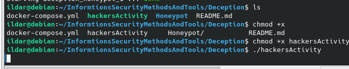

# Deception
## Запуск контейнера

## Запуск хакерской активности

## Запуск сканирования nmap'ом
### sudo nmap localhost -A -sS -O -p0- -vvv

## Найденные запущенные службы
### FTP

### Команды, найденные в логах

	Происходит логин с anonymous:anonymous
	Вывод на экран текущей директории
	Загрузка на сервер скрипта exploit.sh
	Замена файла /etc/passwd

### SSH

### Команды, найденные в логах

	cd / - Переход в корневую директорию
	ss -tunlp - Вывод открытых портов и запущенных служб
	ls -la - Просмотр текущей директории
	whoami - Вывод имени текущего пользователя

### Telnet

### Команды, найденные в логах

	display arp - Вывод ARP таблицы
	display arp interface GigabitEthernet 0/0/1 - Вывод информации интерфейса gi0/0/1

### HTTP

### Команды, найденные в логах

	Попытки через payload вызвать различные методы сервера

### Redis

### Команды, найденные в логах

	Попытка вывести информацию о клиентах, админе и ключах