# Фишинг с gophish

## Клонирование репозитория
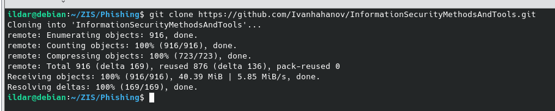

## Запуск контенейра
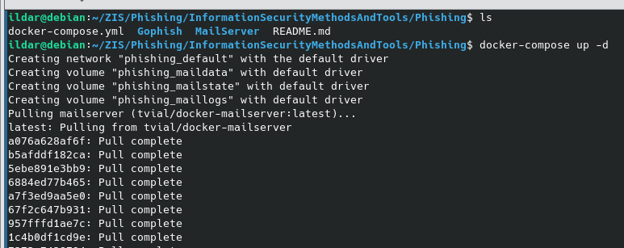

## Создание сертификатов

## Создание пользователей с пересборкой контейнера

## Тестирование SMTP с помощью swaks
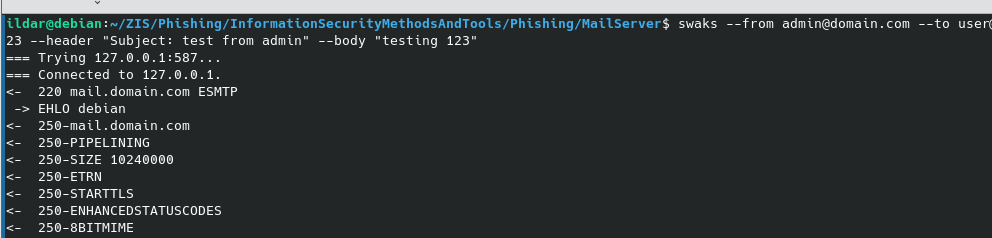

## Sending profile
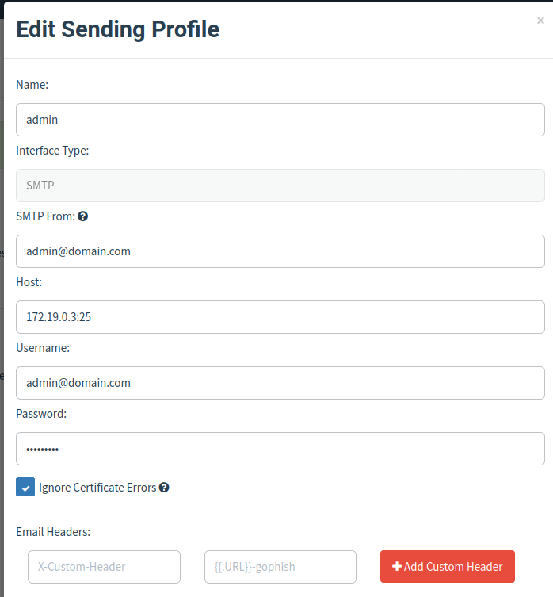

## Тестовое сообщение
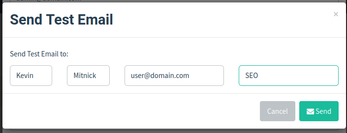

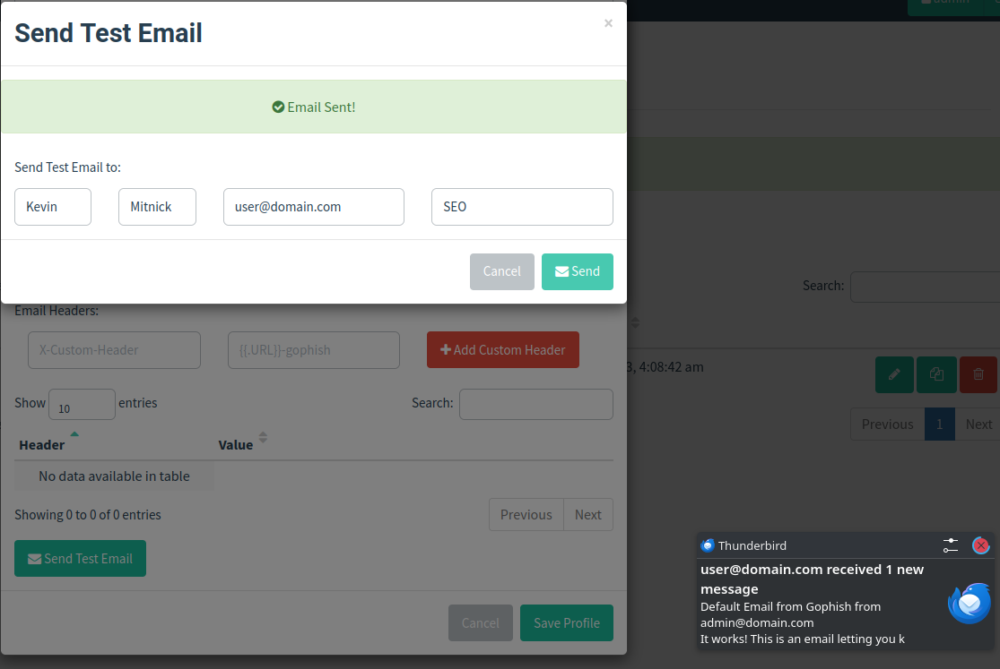

## Настройка почтового клиента ThunderBird 
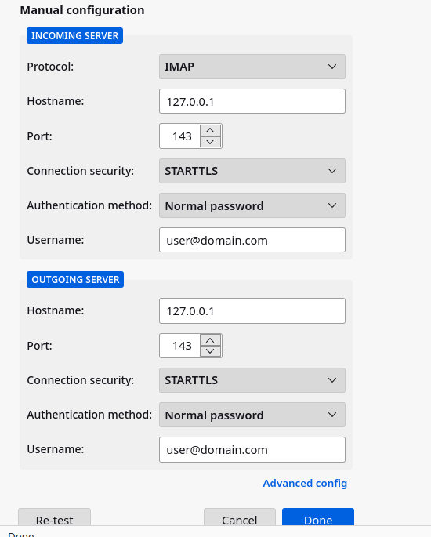

## Настройка фишинговой страницы
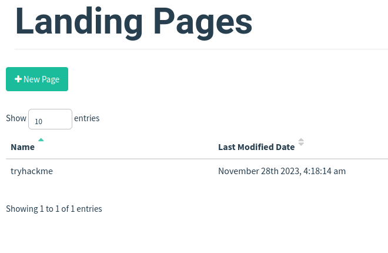

## Настройка шаблона фишингового письма
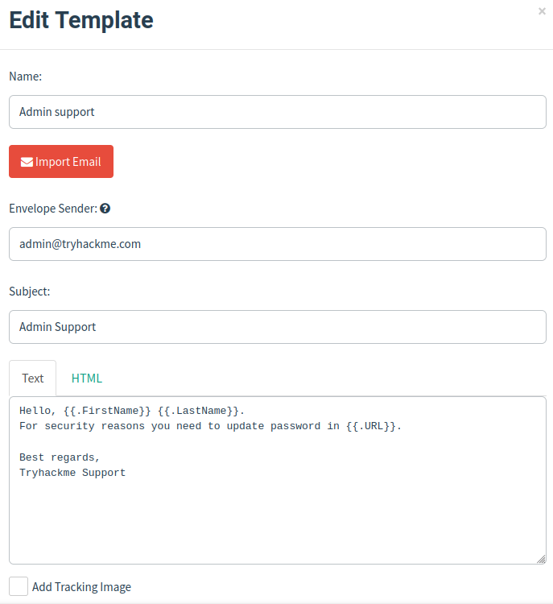

## Настройка получателей рассылки
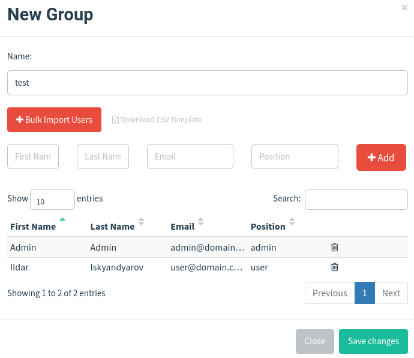

## Запуск фишинговой кампании 
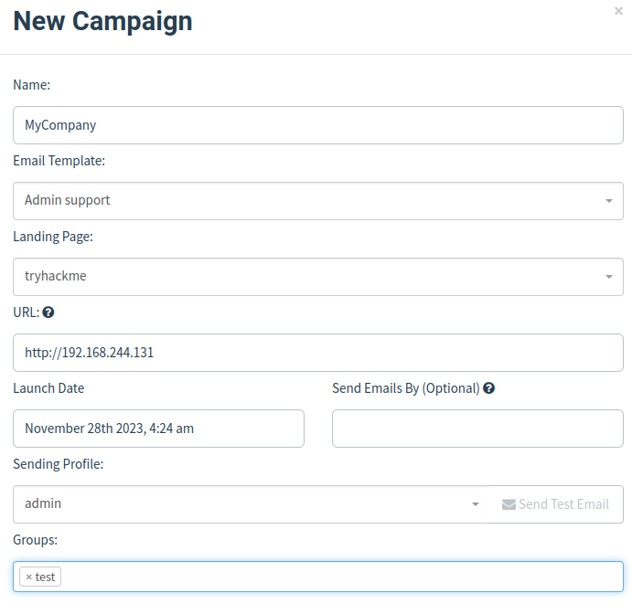

## Полученное сообщение
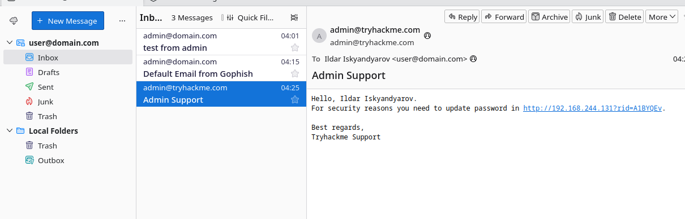

## Переход по ссылке из письма

## Статистика запущенной кампании
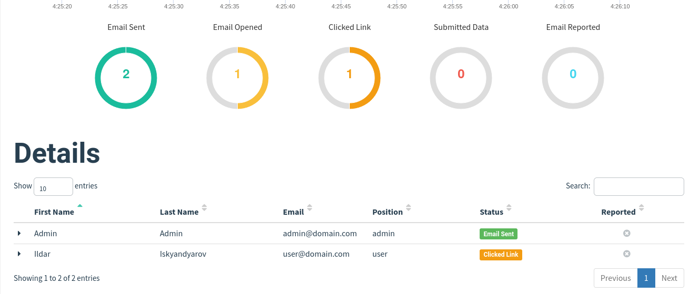