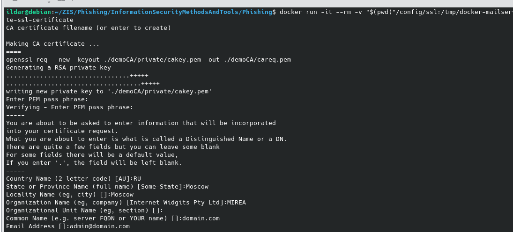
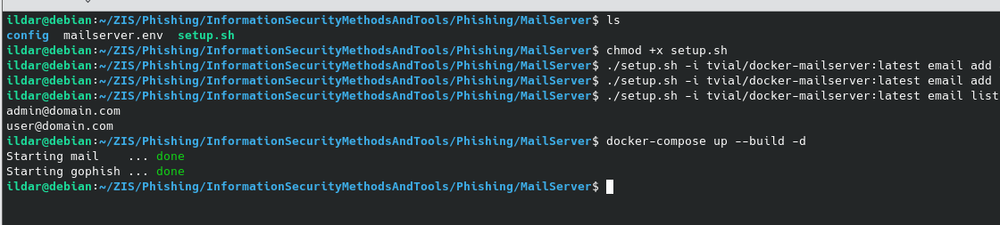

# Фишинг с gophish

## Клонирование репозитория

## Запуск контенейра

## Создание сертификатов

## Создание пользователей с пересборкой контейнера

## Тестирование SMTP с помощью swaks

## Sending profile

## Тестовое сообщение

## Настройка почтового клиента ThunderBird 

## Настройка фишинговой страницы

## Настройка шаблона фишингового письма

## Настройка получателей рассылки

## Запуск фишинговой кампании 

## Полученное сообщение

## Переход по ссылке из письма

## Статистика запущенной кампании
