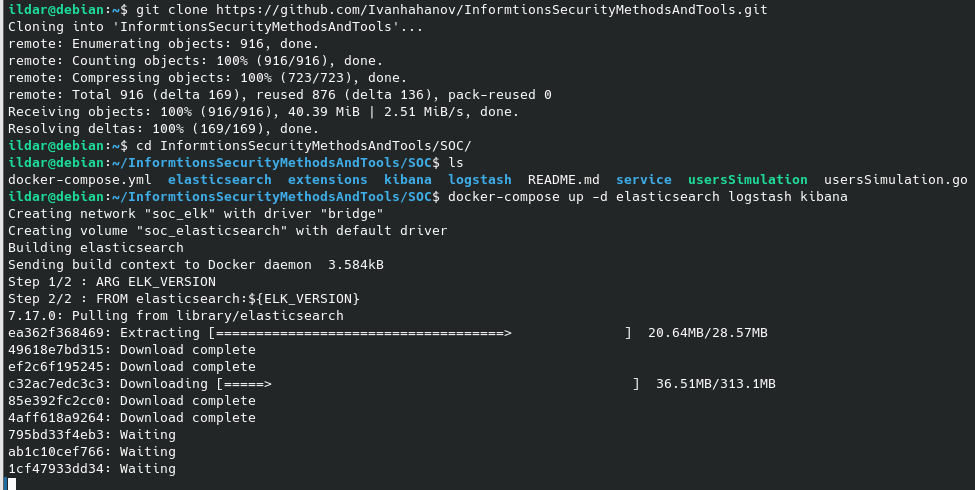
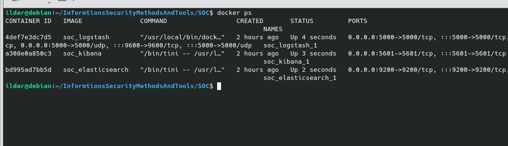
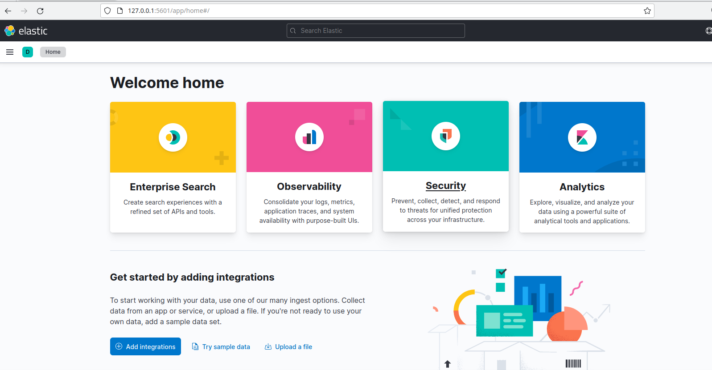
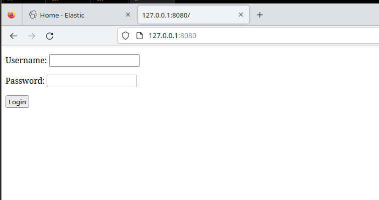
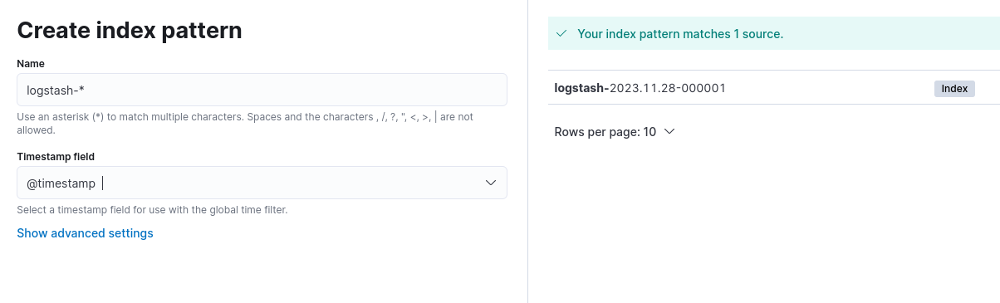
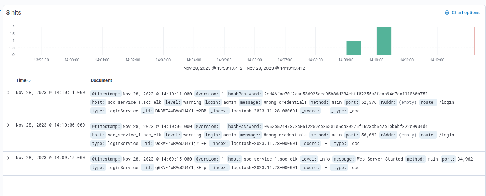
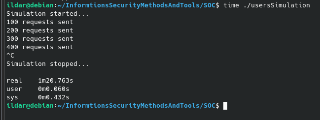
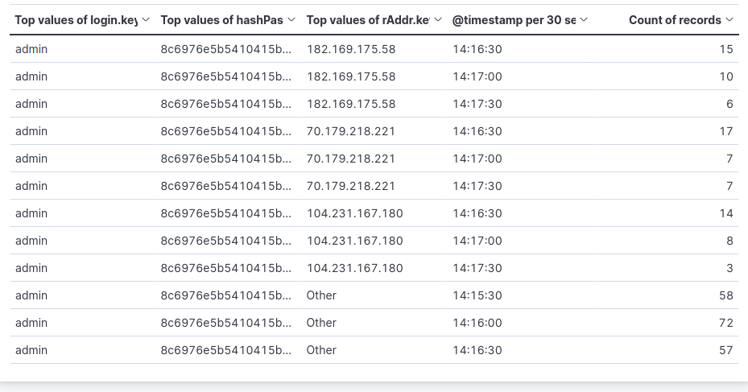

# Логирование и визуализация с помощью elastic, logstash, kibana

## Клонирование репозитория, запуск контейнеров

## Проверка состояния контейнеров

## Успешный вход в elastic

## Проверка работоспособности формы ввода логина/пароля

## Создание индекса с помощью маски logstash-*

## Активность в логах по паттерну

## Запуск симуляции активности, продолжительность 1м20с

## Средства визуализации логов
