# WAF

## Запуск контейнера
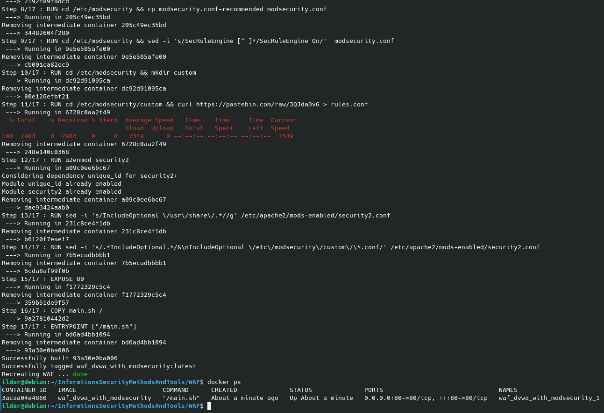

## Успешный логин в панели
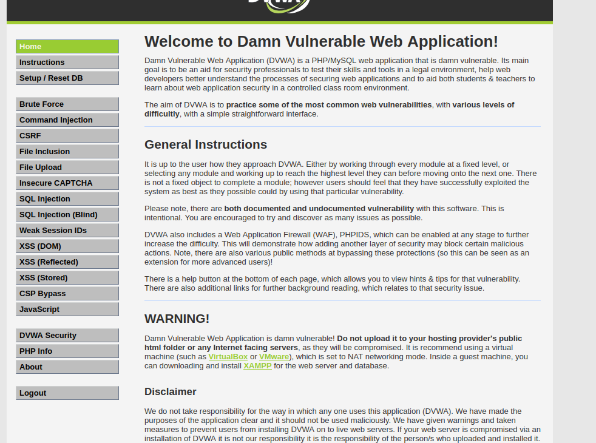

## Command injection (low)
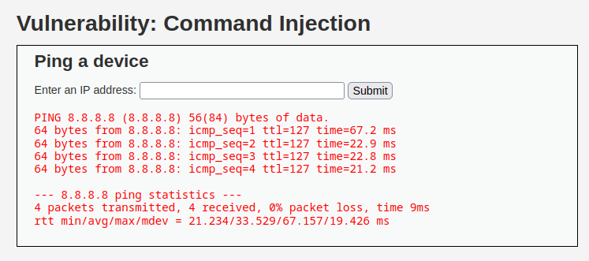

## Command injection (high)
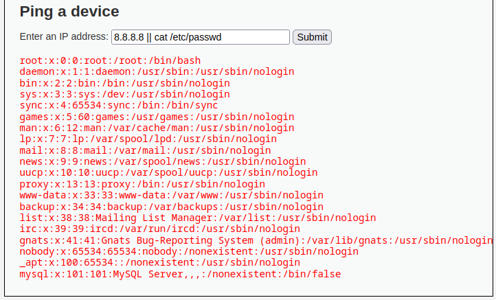

## File inclusion (low)
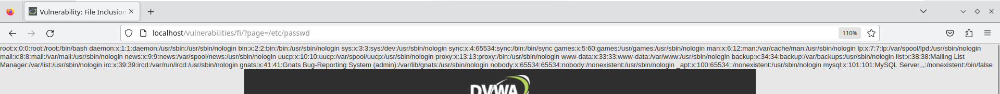

## File inclusion (high)
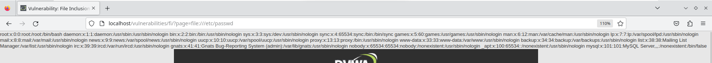

## SQL Injection (low)
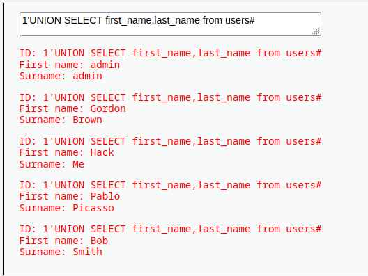

## SQL Injection (high)
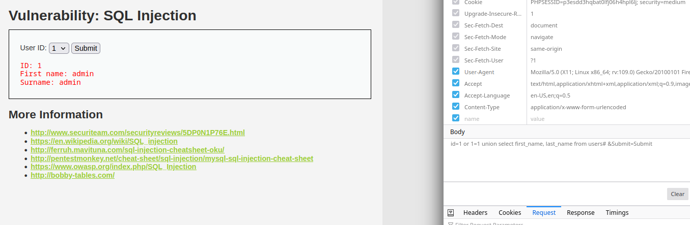

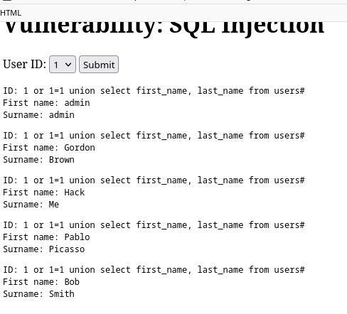

## XSS Reflected (low)
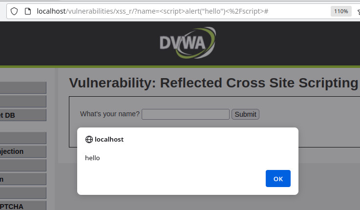

## Правила для WAF (до изменений)
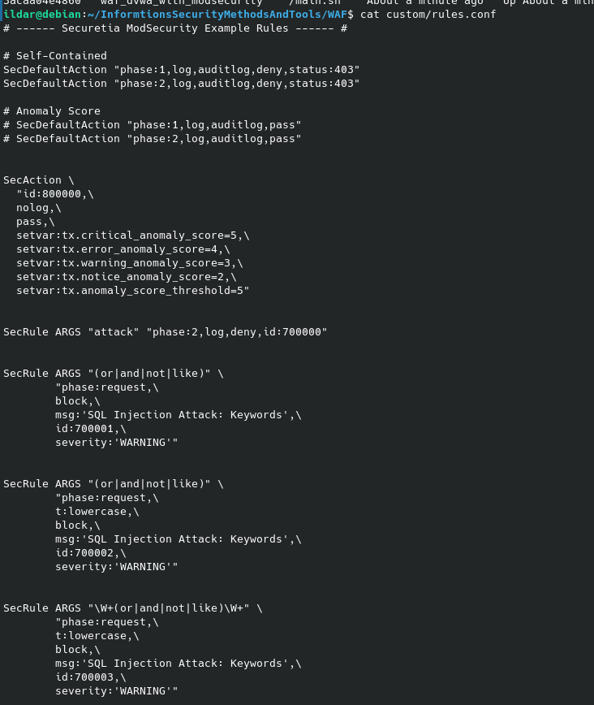

## Измененные правила
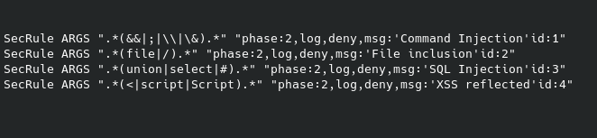

## Логи после применения правил
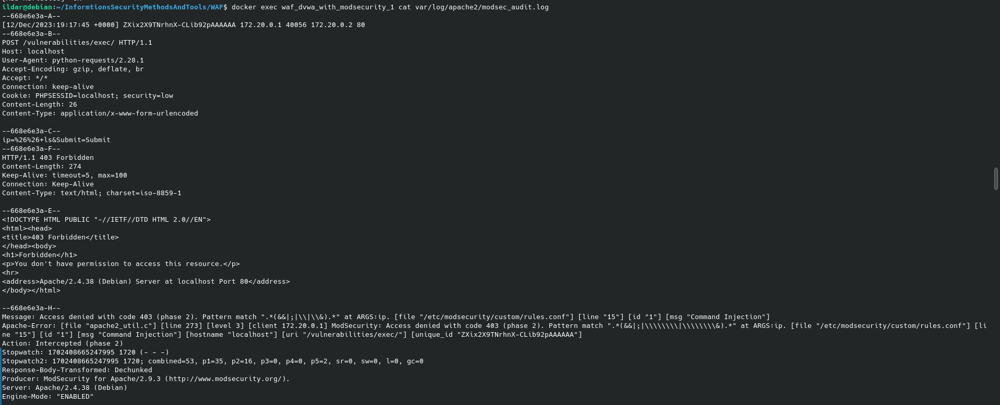

## Пройденный тест exploitation.sh
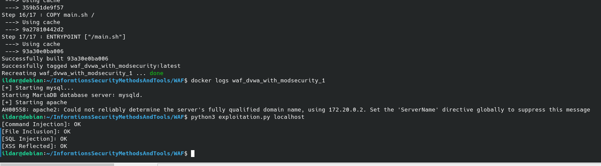